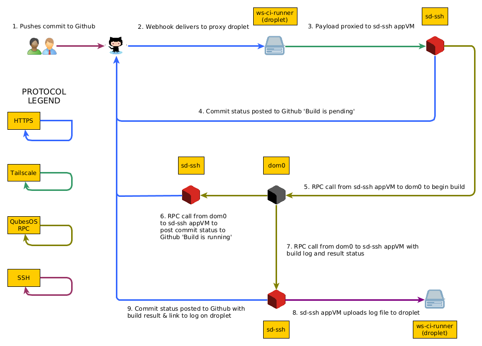

# Securedrop Workstation Continuous Integration scripts

## About

This collection of scripts is for running the securedrop-workstation CI on a Qubes device.

## Installation instructions

Please see the [INSTALL.md](INSTALL.md).

## How it works

1. The webhook in Github delivers the payload to the proxy droplet.

2. The proxy droplet proxies the payload through to the sd-ssh VM running on a Qubes device, via the
   Tailscale tunnel.

3. The sd-ssh VM sends a commit status to Github notifying that the build has been received and is
   pending.

4. The sd-ssh VM clones the repository and checks out the commit learned from the payload, at
   `/var/lib/sdci-ci-runner/securedrop-workstation_{SHA}`.

5. The sd-ssh VM sends an RPC call to the dom0 to run the `runner.py` (wrapped in flock to avoid
   concurrent builds).

6. The runner.py reports a commit status back to Github (via sd-ssh) that the build has started (or,
   if there is a build already running, that it is queued).

7. The runner.py tarballs up the codebase from the sd-ssh VM, and proceeds with the
   `make clone; make dev; make test` sequence, logging all output to a log file.

8. The runner.py then leverages the securedrop-workstation's `sdw-admin.py --uninstall --force` to
   tear everything down, along with cleaning up some remaining cruft.

The runner.py will detect if any of the commands succeed or fail but it should not abort on failure
(so that the teardown still completes).

9. At the end of the process, the dom0 will copy its log file to the sd-ssh VM and then calls
   `upload-report` on the sd-ssh VM with the status of the build.

10. That `upload-report` script will upload the log to the ws-ci-runner proxy for viewing in a
   browser at https://ws-ci-runner.securedrop.org, and will also post a commit status to Github,
   with the `target_url` pointing to the HTTPS URL of that log file on the ws-ci-runner, and with
   the status of the build. At this point, the commit shows either a green tick or a red cross and
   has a link to the log file.

## Queuing and canceling builds

The webhook can handle multiple commits delivered to it. The jobs get issued to the dom0 with a
maximum `flock` wait of 86400s (24h).

If another job is already running, it means the lock is held, so the other jobs wait for the lock to
be released before starting.

Once the lock releases, one of the pending jobs will claim the lock and start running.

While a job is waiting, the commit in Github has a status of 'pending' with the message 'The build
is queued'.

When a build starts, the commit status changes to a description of 'The build is running'. The
commit status state is technically still 'pending' because Github makes no distinction between
'queued' and 'running', except in the description field of the commit status.

If you need to cancel a build that is queued, run `cancel.py --sha xxxxxxxx` on the sd-ssh VM. This
will:

- remove the codebase that was checked out to this commit on sd-ssh
- kill the pending process on the dom0 (by way of the qubes.SDCICanceler RPC script)
- update the git commit status at Github to say that this build was canceled by an administrator.
  The commit status will now be of state 'error' with a red cross.

## Automatic updates of the sd-ssh VM

The installation adds a systemd timer and script to perform daily updates of the sd-ssh VM to keep
it up to date.
