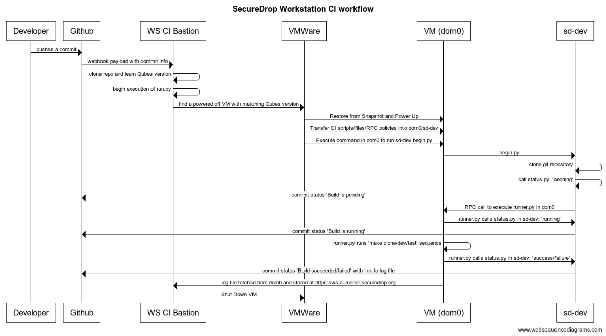

# Securedrop Workstation Continuous Integration scripts

## About

This collection of scripts is for running the securedrop-workstation CI on a hypervisor that is
running Qubes virtual machines.

## Installation instructions

Please see the [INSTALL.md](INSTALL.md).

## How it works

1. The webhook in Github delivers the payload to a remote server via HTTPS.

2. The server passes that payload to a Flask service that parses the payload. This service
   then posts a commit status to Github saying the build is 'queued'.

3. The Flask service executes the `run.py` script which makes calls to a hypervisor (currently
   VMware) to find a Qubes VM with a matching version, restore it from snapshot and boot it.

4. The script adds various files to the dom0 and the sd-dev StandaloneVM on that Qubes VM.

5. The script then instructs dom0 to run a command on the sd-dev StandaloneVM to clone the
   SDW CI repository and then issue an RPC call to the dom0 to run the `dom0/runner.py`
   script.

6. The runner.py reports a commit status back to Github (via sd-dev) that the build has started.

7. The runner.py tarballs up the codebase from the sd-dev VM, and proceeds with the
   `make clone; make dev; make test` sequence, logging all output to a log file.

   The runner.py will detect if any of the commands succeed or fail. If a step fails, the
   whole procedure is halted. In either case, a commit status is sent back to Github indicating
   whether it was a success or a failure.

8. At the end of the process, the server copies the log file from dom0 and stores it in the
   same place that the commit status links to, for viewing later.

9. The Qubes VM is then powered off.

## Parallelization

The server is able to iterate until it finds a Qubes VM that is powered off. If it's off, it
assumes it is available for use.

If all Qubes VMs with the matching version are powered on, it's assumed that they are all busy
running CI runners already. In this case, it sleeps for up to 1 hour and keeps occasionally
retrying throughout.
